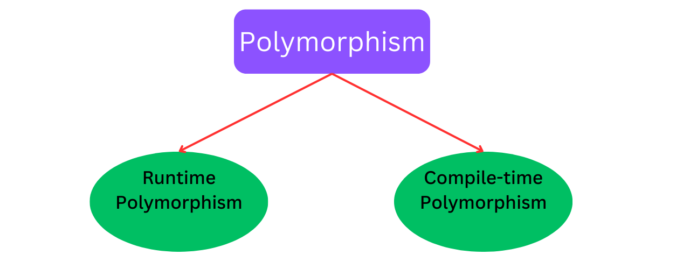

Encapsulation is a fundamental principle in object-oriented programming (OOP) where the internal state of an object is hidden from outside access. In Java, encapsulation is achieved using access modifiers.
Let's dive into concept of Encapsulation and Polymorphism more deeply with a lots of examples.

## What is Encapsulation ?

Encapsulation is a process of binding the class of memeber into a single unit.It protects the data of class to be accessed from outside the class. However it is accessed outside the class by using access modifier let's see how.

### Example:

```java
public class Person {
    private String name;
    private int age;

    // Constructor
    public Person(String name, int age) {
        this.name = name;
        this.age = age;
    }

    // Getter for name
    public String getName() {
        return name;
    }

    // Setter for name
    public void setName(String name) {
        this.name = name;
    }

    // Getter for age
    public int getAge() {
        return age;
    }

    // Setter for age
    public void setAge(int age) {
        if (age > 0) {
            this.age = age;
        } else {
            System.out.println("Age cannot be negative.");
        }
    }

     @Override
    public String toString() {
        return "Person{" +
                "name='" + name + '\'' +
                ", age=" + age +
                '}';
    }
}

// Main.java
public class Main {
    public static void main(String[] args) {
        Person person = new Person("shubham", 22);
         System.out.println(person);
        person.setName("pawan");
        person.setAge(29);
        System.out.println(person);

    }
}
```

```powershell
Person{name='shubham',age=22}
Person{name='pawan', age=29}
```

In this example, the Person class encapsulates the data (name and age) and provides public methods to access and modify this data. The data members name and age are declared as private, restricting direct access from outside the class. Instead, access to these fields is controlled through the public getter and setter methods. This encapsulation ensures data integrity by enforcing constraints, such as age cannot be negative.

## Polymorphism

The word "poly" means many and "morphs" means forms, So polymorphism means many forms. it is ability of objects to take on multiple forms or to be treated as instances of their parent class. 

## Types of polymorphism




## Runtime Polymorphism (Method Overriding)

It occurs when a subclass provides a specific implementation of a method that is already defined in its superclass. It allows you to invoke methods on objects of different classes through a reference to their common superclass or interface.

### Example:
``` java
// Parent class or Base class
class Animal {
    public void sound() {
        System.out.println("Animal makes a sound");
    }
}

// Subclass of Animal
class Cow extends Animal {
    @Override
    public void sound() {
        System.out.println("cow moo");
    }
}

// subclass of Animal
class Cat extends Animal {
    @Override
    public void sound() {
        System.out.println("cat meows");
    }
}

// Main.java
public class Main {
    public static void main(String[] args) {
        Animal cow = new Cow(); 
        Animal cat = new Cat(); 
        Animal animal= new Animal();
        Cow cow1= new Cow();
        Cat cat1= new Cat();
        animal.sound();
        cow.sound(); 
        cow1.sound();
        cat.sound(); 
        cat1.sound();
    }
}
```
```powershell
output
Animal makes a sound
cow moo
cow moo
cat meows
cat meows
```

## Compile-time Polymorphism (Method Overloading)

 It occurs when multiple methods in the same class have the same name but different parameters.When you call an overloaded method, the Java compiler determines the most appropriate method to execute based on the arguments you pass.

 ### Example:

 ```java
 class Example {
    // Method with one integer parameter
    void display(int a) {
        System.out.println("Method with int parameter: " + a);
    }

    // Method with one String parameter
    void display(String b) {
        System.out.println("Method with String parameter: " + b);
    }
      // Method with one double parameter
     void display(double c) {
        System.out.println("Method with double parameter: " + c);
    }
}

public class Main {
    public static void main(String[] args) {
        Example obj = new Example();

        // Calls the method with int parameter
        obj.display(5);

        // Calls the method with String parameter
        obj.display("Hello");
       // Calls the Method with double parameter
        obj.display(5.55);
    }
}
 ```
 ```powershell
 output

 Method with int parameter: 5
 Method with String parameter: Hello
 Method with int parameter: 5.55
 ```

 ## Avantages of Polymorphism

 1. Increases code reusability by allowing objects of different classes to be treated as objects of a common class.

 2. Improves readability and maintainability of code by reducing the amount of code that needs to be written and maintained. 


